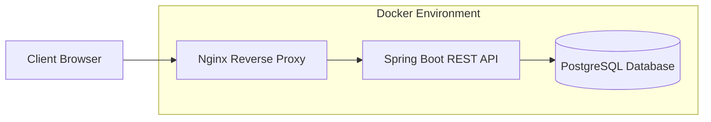
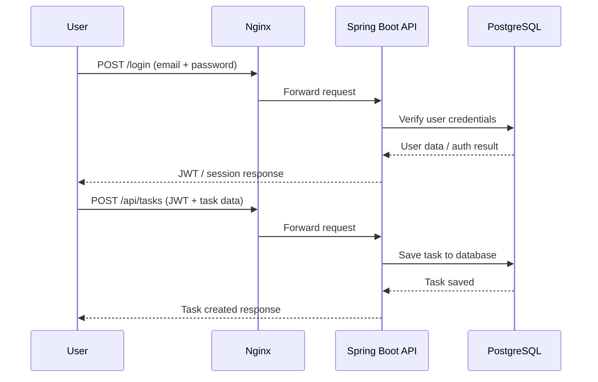

### Hexlet tests and linter status:
[](https://github.com/alexeymelekhov-dev/spring-boot-project-99/actions)


[](https://sonarcloud.io/summary/new_code?id=alexeymelekhov-dev_spring-boot-project-99)

# 🚀 Spring Boot Task App

A backend application for task management, deployed using Docker with PostgreSQL and Nginx reverse proxy.

---

## 🌍 Live Demo

🚀 Application is deployed and available at:

http://185.247.185.121/

---

## 🔐 Demo Credentials

For testing purposes, you can use:

- Email: `hexlet@example.com`
- Password: `qwerty`

> ⚠️ This is a demo account used for testing the application.

---

## 📚 API Documentation

Swagger UI is available for interactive API testing:

🔗 **Swagger UI:** http://185.247.185.121/swagger-ui/index.html

Features:
- Explore all REST endpoints
- Execute requests directly from browser
- Inspect request/response schemas
- Useful for testing and debugging

---

## 🧱 Tech Stack

- Java 21
- Spring Boot
- Spring Data JPA
- PostgreSQL 16
- Docker & Docker Compose
- Nginx (reverse proxy)

---

## 🧱 Architecture Diagram



---

## 🔁 API Flow Diagram

### 1. Login and Task Creation Flow



---

## 🚀 How to Run Locally

### Clone repository

```bash
git clone https://github.com/your-repo/spring-boot-project-99.git
cd spring-boot-project-99
```

### Start project

```bash
docker compose up --build -d
```

---

## 📌 Features

- REST API for task management
- CRUD operations
- PostgreSQL database integration
- Swagger documentation
- Dockerized deployment
- Nginx reverse proxy
- CI/CD with GitHub Actions
- Code quality checks (SonarCloud)
